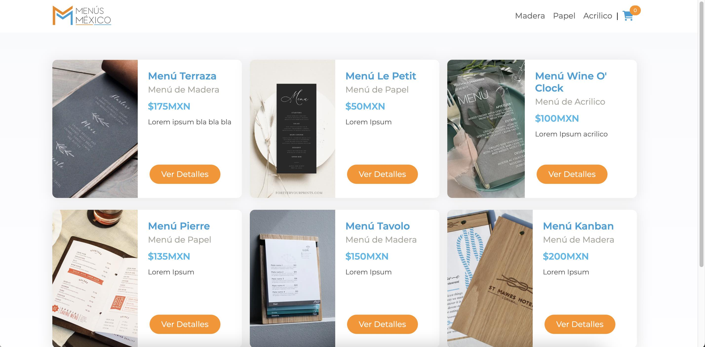

# Ecommerce Menús México

Esta tienda en línea fue elaborada durante el curso de ```ReactJS en Coderhouse``` aquí podrás encontrar y comprar diversos productos dirigidos hacía el sector restaurantero.

## Tecnologías implementadas:
**Código:** ReactJS, HTML y CSS
**Librerías:** Sweet Alert
**Base de datos:** Firestore Database

## Características:
* Los usuarios podrán filtrar los productos por categorías.
* Los usuarios podrán adquirir los productos que desee, siempre que el stock de estos este disponible.
* Desde el lado del administrador se podrán crear los productos necesarios mediante Firestore Database.
* Una vez hecha la compra el stock de los productos comprados se actualizara con cada compra.

## Capturas:




## Autor:
[Josafat López](https://josafatlopez.com.mx/)

## Agradecimientos:
* [Alejandro Fernandez](https://www.linkedin.com/in/alejandro-fernandez-755324a9/)
* [Jesús Lencina](https://www.linkedin.com/in/jesuslencina/)
* [Coderhouse](https://www.coderhouse.com.mx/)